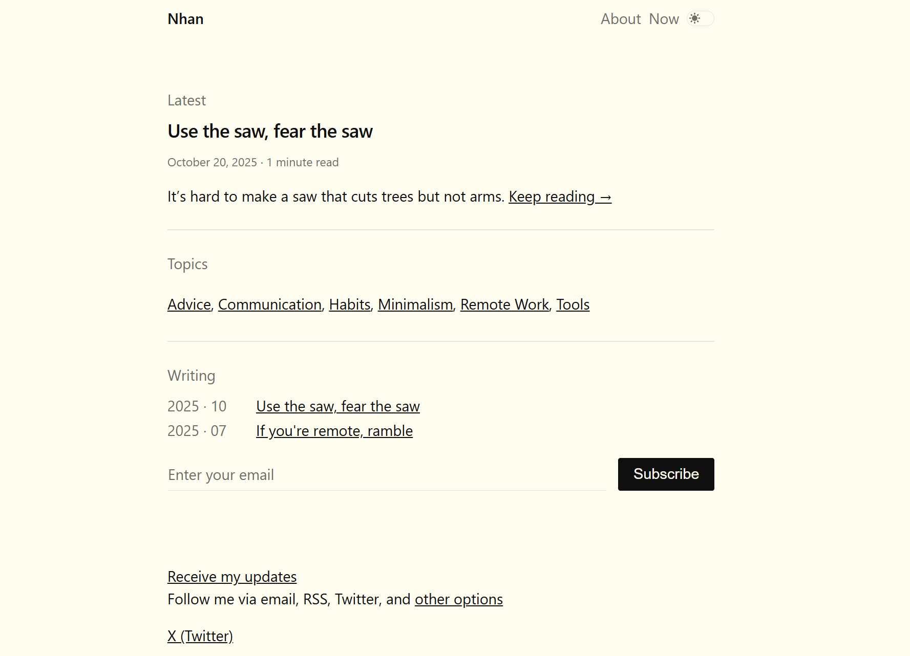

# Nhanoki

A minimalist Hugo theme focused on content, inspired by [stephango.com](https://stephango.com). Features dark/light mode, taxonomies (topics & tags), advanced code blocks (Dracula, line highlighting, file names, copy button), and sticky footer layout.


## Requirements

- Hugo **extended** v0.146.0 or higher (uses new template system `_partials`, `_markup`).

## Installation

Place the theme in `themes/nhanoki` directory and declare it in your site's config file:

```toml
theme = 'nhanoki'
```

Run dev server:

```bash
hugo server -D
```

## Configuration

Example `hugo.toml` in your site's root directory:

```toml
baseURL = 'https://example.org/'
locale = 'en-us'
title = 'Nhan'
theme = 'nhanoki'

[params]
  author = "Nhan"
  description = "Life is short, live it well"

# Taxonomies: topics and tags
[taxonomies]
  topic = "topics"
  tag = "tags"

# Navigation menu (displayed on right side of header)
[menu]
  [[menu.main]]
    name = "About"
    url = "/about"
    weight = 10
  [[menu.main]]
    name = "Now"
    url = "/now"
    weight = 20

# Code block styling
[markup]
  [markup.goldmark.renderer]
    unsafe = true            # allow HTML in markdown
  [markup.highlight]
    style = "dracula"        # change style as needed (e.g., github, monokai, flexoki)
    noClasses = true
    lineNos = true
    lineNumbersInTable = false
    tabWidth = 2

# RSS
[outputs]
  home = ["HTML", "RSS"]
  section = ["HTML", "RSS"]
```

### Page title & menu

- `title` displays on the left side of the header.
- Items in `[menu.main]` display on the right side of the header, along with the dark/light mode toggle.

## Creating content

### Posts

Posts go in `content/posts/`. Basic front matter:

```markdown
---
title: "Use the saw, fear the saw"
date: 2025-10-20T10:00:00Z
draft = false
topics = ["advice", "tools", "minimalism"]
---

Opening text displays as summary.
<!--more-->

Remaining content...
```

- `<!--more-->` sets the summary displayed on the homepage ("Keep reading →").
- `topics` attaches the post to the `topics` taxonomy.

### Static pages

Create `content/about.md`, `content/now.md`... with `title` front matter. Pages to appear in the menu should be declared in the config's `[menu.main]` (don't use `menu: main` in front matter to avoid duplication).

## Adding images

**Always use leaf bundles** for posts with images: create a folder containing `index.md` and place images alongside it.

```
content/posts/use-the-saw-fear-the-saw/
├── index.md
└── download.jpg
```

In `index.md`:

```markdown

```

> ⚠️ DO NOT place `index.md` directly in `content/posts/`. This turns the entire `posts` directory into a leaf bundle and other posts will disappear. If you need a section landing page, use `_index.md`.

Image render hook (`layouts/_markup/render-image.html`) automatically resolves relative paths to page resources and adds `loading="lazy"`.

## Code blocks

Use fence syntax with attributes in curly braces:

````markdown
```java {title="A.java" hl_lines="2 5"}
public class A {
    private static String name = "Nhan";

    public static void main(String[] args) {
        System.out.println(name);
    }
}
```
````

- **`title`** → shows file name bar above (optional).
- **`hl_lines`** → highlights lines, separated by spaces or commas; supports ranges like `"2 5-7"` (optional).
- **Line numbers** and **color theme** come from `[markup.highlight]` in config.
- **Copy button** appears in top-right corner of each code block (requires JavaScript).

## Dark / Light mode

- Toggle button is in the header, saves choice to `localStorage`, defaults to `prefers-color-scheme`.
- Icons use `static/sun.svg` and `static/moon.svg`. Replace these files to change icons.

## Newsletter

Partial `layouts/_partials/newsletter.html` displays signup form (placed between `main` and `footer` in `baseof.html`). Edit form content/endpoint in this partial file.

## Theme structure

```
themes/nhanoki/
├── assets/
│   ├── css/main.css        # all styles (including "Nhanoki component layout")
│   ├── css/font.css        # Open Sans font (optional import)
│   └── js/main.js          # theme toggle + code copy button
├── layouts/
│   ├── baseof.html         # layout frame (header/main/newsletter/footer)
│   ├── home.html           # homepage: Latest, Topics, Writing
│   ├── page.html           # post / static page
│   ├── section.html        # post list by section
│   ├── taxonomy.html       # topics/tags list
│   ├── term.html           # post list by single topic/tag
│   ├── _partials/          # head, header, footer, newsletter
│   └── _markup/            # render hooks for image & codeblock
└── static/                 # sun.svg, moon.svg
```

## Quick customization

- **Colors & layout:** edit CSS variables and the `/* Nhanoki component layout */` section at the end of `assets/css/main.css`.
- **Content width:** use `--wrap-normal` / `--wrap-wide` variables.
- **Code style:** change `style` in `[markup.highlight]` (see Chroma styles list).

## License

Theme uses CSS based on design by Steph Ango and color palette [Flexoki](https://github.com/kepano/flexoki) (MIT).
